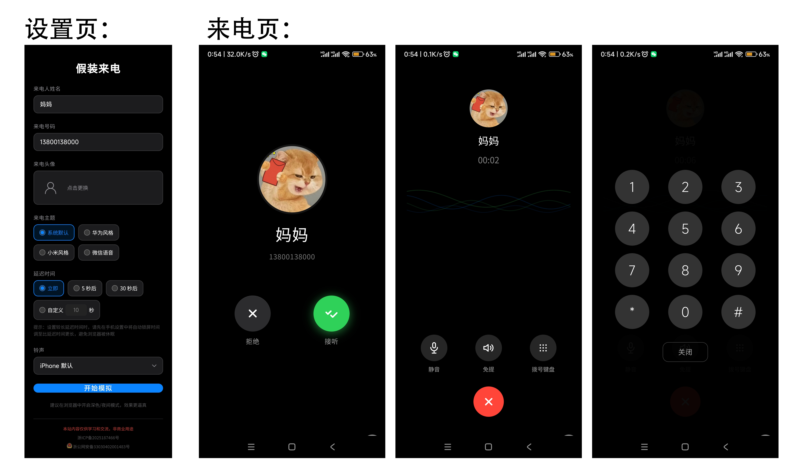

# 假装来电

一个纯前端网页工具，模拟手机来电界面，帮助你优雅地脱身。

## 功能

- **四种来电主题**：iOS 18 风格、华为 HarmonyOS 4、小米 HyperOS、微信语音通话
- **可自定义**：来电人姓名、号码、头像
- **定时来电**：支持立即、5 秒、30 秒以及自定义延迟时间
- **多种铃声**：Web Audio API 合成的 iPhone、华为、小米、微信风格铃声，支持静音
- **伪装息屏**：倒计时 1 秒后屏幕全黑，模拟手机息屏状态
- **来电振动**：匹配各主题的振动模式
- **通话模拟**：接听后显示通话计时和声波动画，支持静音、免提、拨号键盘

## 技术栈

纯 HTML + CSS + JavaScript，无框架依赖。直接打开 `index.html` 或部署到任意静态服务器即可使用。

## 使用方式

1. 打开页面，在设置页填写来电人信息
2. 选择来电主题和延迟时间
3. 点击「开始模拟」
4. 倒计时结束后自动弹出仿真的来电界面
5. 接听或拒绝来电

## 本地运行

```bash
# 任意静态服务器均可
python3 -m http.server 8000
```

浏览器访问 `http://localhost:8000`。

## 截图


